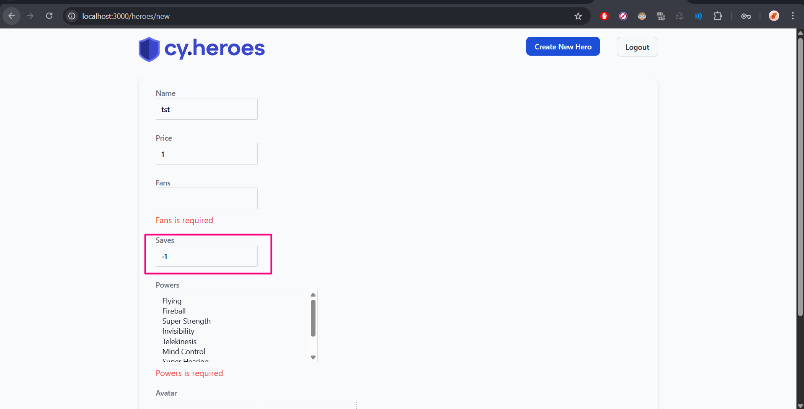
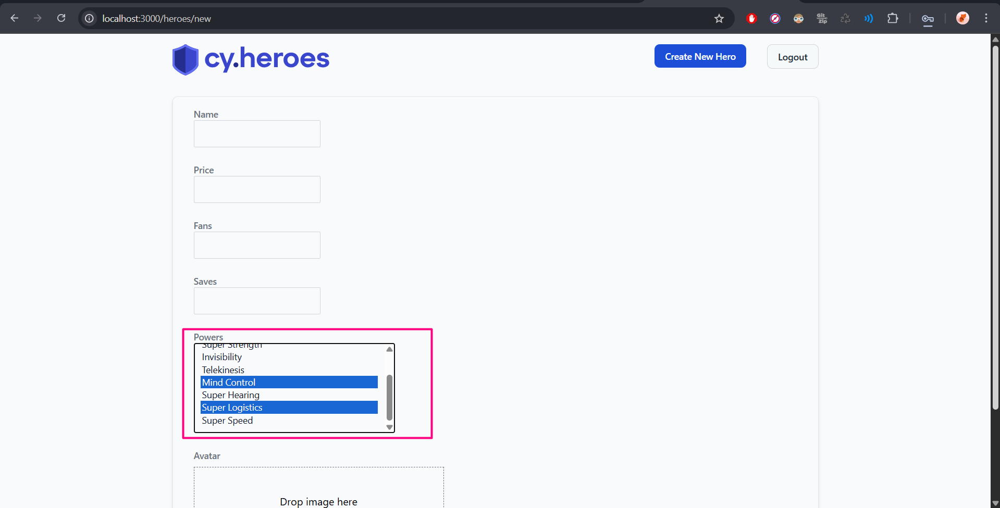
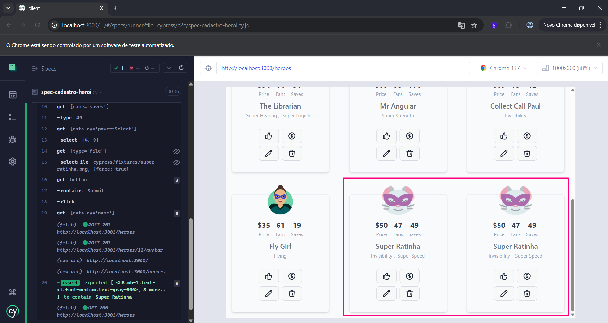

## Bugs encontrados no Cypress Heroes 🐞

### Lista de bugs

#### Bug 01: Contador negativo no campo "Saves" na página de cadastro de herói
- Descrição: Ao cadatrar um herói no app e não preencher o campo "Saves", ao clicar no botão "Submit" da página de cadastro de herói, o campo em questão fica com o contador negativo, como -1.
- Passos para execução do bug:
    1. Clicar no botão "Create New Hero" para criar o herói
    2. Deixar o campo "Saves" vazio
    3. Clicar no botão "Submit"
- Resultado obtido: o campo "Saves" fica com o contador negativo, sendo -1 e não 0 ou vazio (como fica o campo "Fans" quando este não recebe nenhum valor atribuído).
- Evidências:
 

    

 

#### Bug 02: Campo "Powers" não permite múltiplas seleções sem usar a tecla Ctrl
- Descrição: Ao tentar selecionar múltiplas opções no campo "Powers" da tela de cadastro de herói, o sistema não permite outras opções selecionadas se não usar a tecla Ctrl do teclado.
- Passos para execução do bug:
    1. Clicar em uma opção do campo "Powers"
    2. Apertar a tecla Ctrl do teclado e clicar em outra opção do mesmo combo
- Resultado obtido: As opções selecionadas ficam em azul
- Evidências: 
 

    

 

#### Bug 03: Cadastro de heróis com mesmo nome
- Descrição: A aplicação está permitindo o cadastro de heróis com mesmo nome de outro já cadastrado.
- Passos para execução do bug:
    1. Acessar a tela de cadastro
    2. Preencher o campo "Name" com um nome de um herói já cadastrado
    3. Prencher os outros campos obrigatórios
    4. Clicar no botão "Submit"
- Resultado obtido: heróis cadastrados com o mesmo nome.
- Evidências:
 

    

