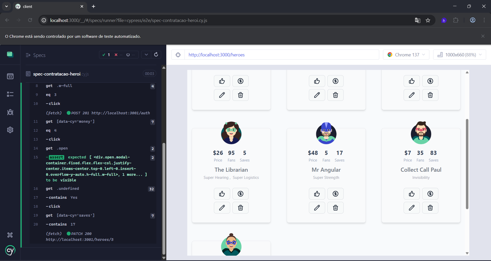
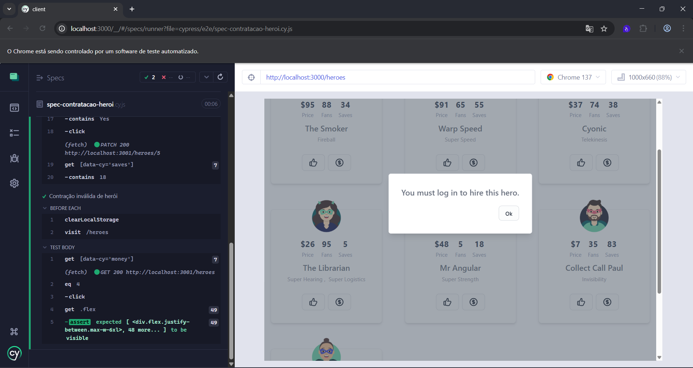
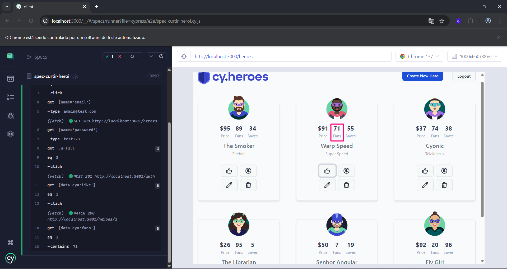
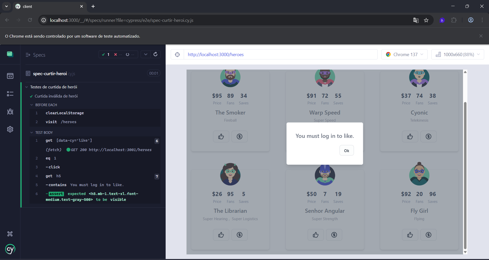
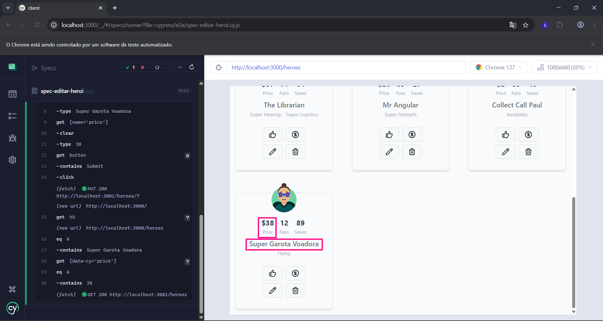

## Cenários e casos de testes das funcionalidades - Cypress Heroes

### Cenário 01: Realizar login 👤

#### CT01: Realizar login com sucesso como Admin ✅
- Pré-condições: ter os dados de acesso de Admin para realizar login
- Passos:  
    1. Na página inicial, clicar no botão “Login”;  
    2. No modal aberto, preencher o campo “Email” com o e-mail válido; 
    3. No campo “Password”, preencher o campo com a senha válida;
    4. Clicar no botão “Sign In”.
- Resultado esperado: o login deve ter sido realizado.
- Resultado obtido: OK

#### CT02: Login inválido ❌
- Pré-condições: ter dados inválidos de acesso para realizar login
- Passos
    1. Na página inicial, clicar no botão “Login”;
    2. No modal aberto, preencher o campo “Email” com o e-mail inválido;
    3. No campo “Password”, preencher o campo com a senha inválida;
    4. Clicar no botão “Sign In”.
- Resultado esperado: deve ser exibida uma mensagem de erro sobre os dados inválidos.
- Resultado obtido: OK

 

### Cenário 02: Realizar logout ⬅️

#### CT03: Realizar logout do app com sucesso
- Pré-condições: ter realizado login com sucesso no app
- Passos:
    1. Na navbar do app, clicar no botão "Logout"
- Resultado esperado: o logout deve ter sido feito com sucesso 
- Resultado obtido: OK

 

### Cenário 03: Cadastrar herói 🦸🏻

#### CT04: Cadastrar herói com sucesso ✅
- Pré-condições: estar logado no app como Admin
- Passos:
    1. Clicar no botão "Create New Hero"
    2. Preencher o campo "Name" com um nome para o herói a ser cadastrado
    3. Preencher o campo "Price" com um valor de contratação do herói
    4. Preencher o campo "Fans" com um número de fãs que o herói deve possuir
    5. Preencher o campo "Saves" com um número de favoritos que o herói recebeu
    6. Selecionar no campo "Powers" (com o ctrl + clique) os poderes que o herói possui
    7. Anexar uma imagem como avatar do herói no campo "Avatar"
    8. Clicar no botão "Submit" para criar o herói
- Resultado esperado: o herói deve ser cadastrado e deverá aparecer na listagem da página "Heroes", exibindo seu nome, preço, número de fãs, número de favoritos dados e seus poderes
- Resultado obtido: OK

#### CT05: Cadastro de herói inválido ❌
- Pré-condições: estar logado no app como Admin
- Passos:
    1. Clicar no botão "Create New Hero"
    2. Preencher o campo "Name" com um nome para o herói a ser cadastrado
    3. Preencher o campo "Fans" com um número de fãs que o herói deve possuir
    4. Preencher o campo "Saves" com um número de favoritos que o herói recebeu
    5. Anexar uma imagem como avatar do herói no campo "Avatar"
    6. Clicar no botão "Submit" para criar o herói
- Resultado esperado: devem ser exibidas mensagens de erro de que o preenchimento dos campos "Name", "Price" e "Powers" são obrigatórios.
- Resultado obtido: OK

 

### Cenário 04: Contratar herói 💰

#### CT06: Contratar herói com sucesso ✅
- Pré-condições: estar logado como Admin
- Passos:
    1. Na tela "Heroes", clicar no botão com ícone "🪙" de um herói escolhido
    2. Clicar no botão "Yes" do modal aberto da contratação
- Resultado esperado: o contador "Saves" do herói escolhido deve ser atualizado para um número maior que o anterior
- Resultado obtido: OK
- Evidências:  

 

    

#### CT07: Contratação de herói inválida ❌
- Pré-condições: não estar logado na aplicação
- Passos:
    1. Na tela "Heroes", clicar no botão com ícone "🪙" de um herói escolhido
    2. Clicar no botão "Yes" do modal aberto da contratação
- Resultado esperado: Uma mensagem informando que é preciso estar logado para fazer a contratação deve ser exibida
- Resultado obtido: OK
- Evidências:
 

    

  

### Cenário 05: Curtir herói 👍🏼

#### CT08: Curtir herói com sucesso ✅
- Pré-condições: estar logado como Admin
- Passos:
    1. Na tela "Heroes", clicar no botão com ícone "👍🏼" de um herói escolhido
- Resultado esperado: a curtida no herói deve ser dada e o contador de curtidas deverá ser atualizado para um número maior que o anterior.
- Resultado obtido: OK
- Evidências: 
 

    

#### CT09: Curtida inválida de herói ❌
- Pré-condições: Não estar logado na aplicação
- Passos:
    1. Na tela "Heroes", clicar  botão com ícone "👍🏼" de um herói escolhido
- Resultado esperado: Uma mensagem informando que é preciso estar logado para curtir o herói escolhido deve ser exibida
- Resultado obtido: OK
- Evidências: 
 

    

 

### Cenário 06: Editar informações do herói ✏️

#### CT10: Editar informações do herói com sucesso ✅
- Pré-condições: estar logado como Admin
- Passos:
    1. Na tela "Heroes", clicar no botão com ícone "✏️" de um herói escolhido
    2. Na tela de edição do herói escolhido, alterar o seu nome no campo "Name"
    3. Alterar o preço de contratação do herói no campo "Price"
    4. Clicar no botão "Submit"
- Resultado esperado: o nome e o preço de contração do herói deverão ser alterados com sucesso.
- Resultado obtido: OK
- Evidências:
 

    

 

### Cenário 07: Excluir herói 🗑️

#### CT11: Excluir herói com sucesso ✅
- Pré-condições: estar logado como Admin
- Passos:
    1. Na tela "Heroes", clicar no botão com ícone "🗑️" de um herói escolhido
    2. No modal de confirmação de exclusão, clicar no botão "Yes"
- Resultado esperado: O herói escolhido deverá ser excluído com sucesso, deixando de aparecer na listagem de heróis cadastrados.
- Resultado obtido: 
- Evidências: